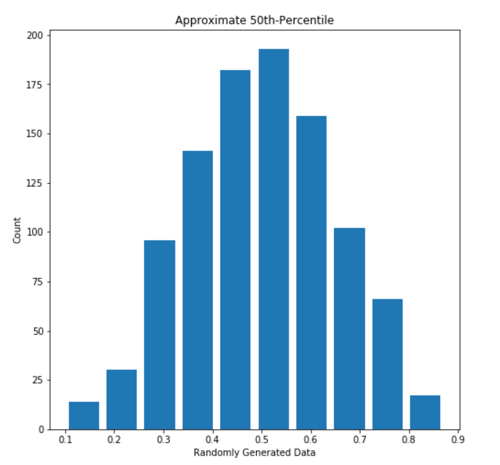
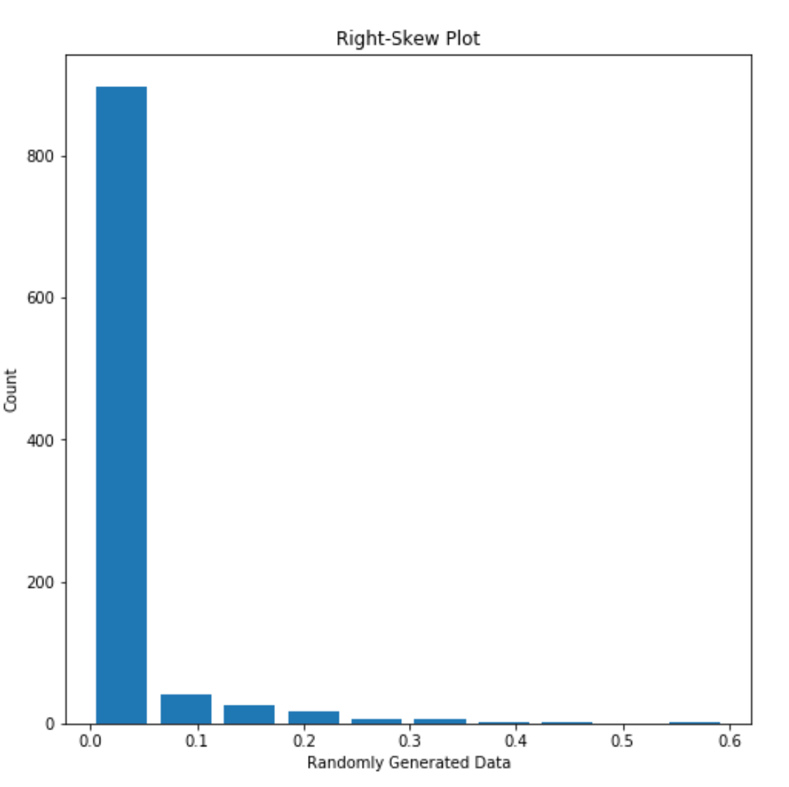
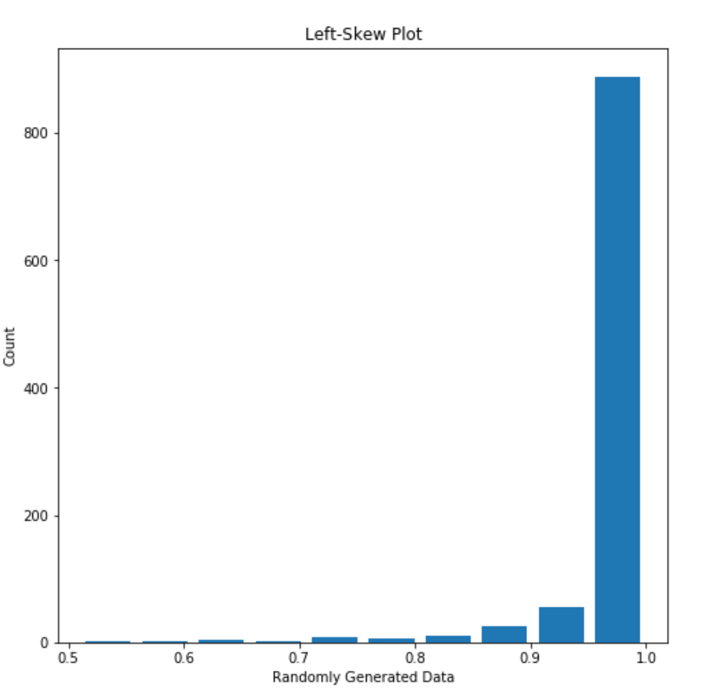
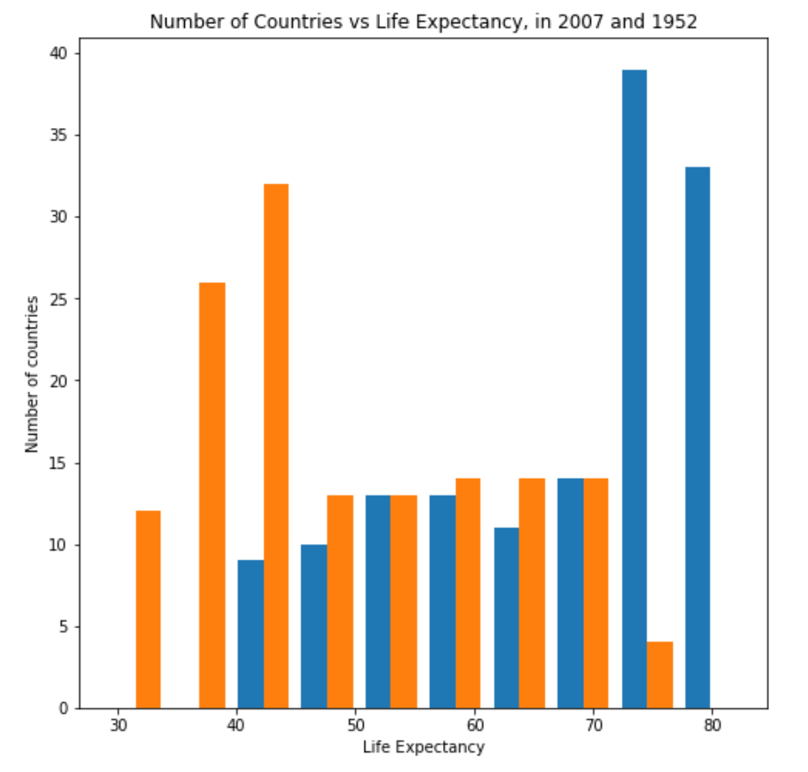
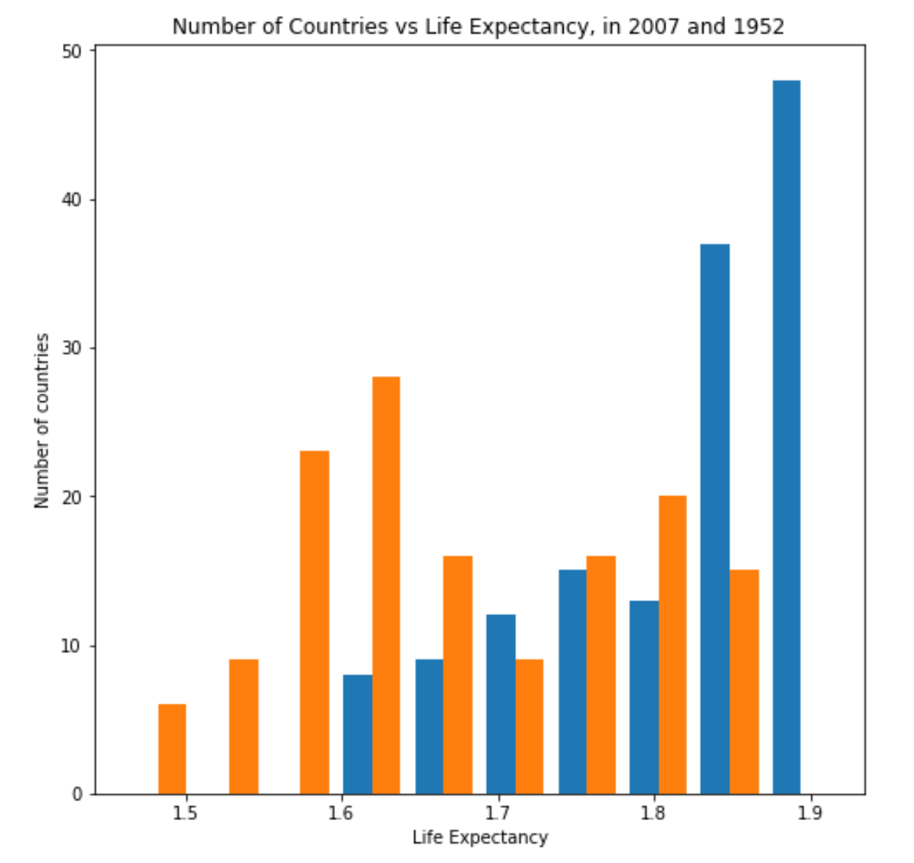
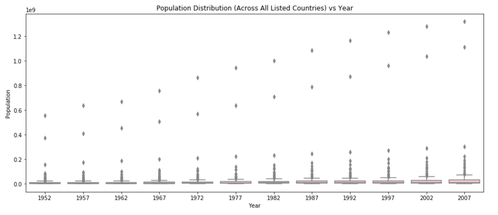
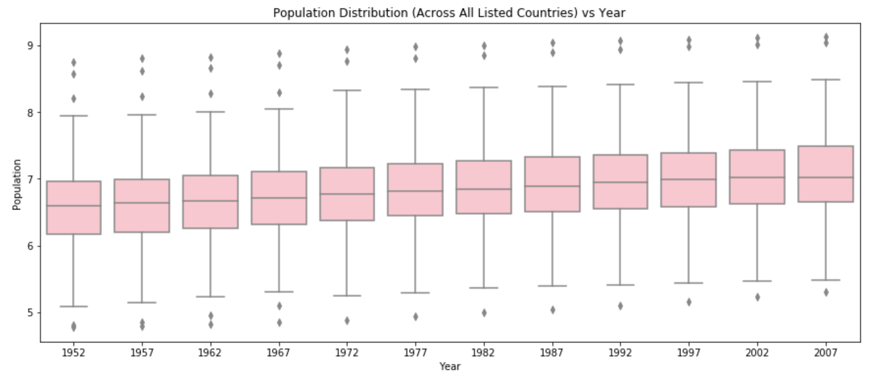

## Continuous, Ordinal, and Nominal Data

**Continuous data** spans some range along a continuum, is typically not countable, and is able to be segmented into increasingly smaller increments.
  e.g. length of time, volume of liquid, mass of an object
  
**Ordinal data** has a chronology or order that must be preserved.
  e.g. order in which runners finish a race, school grade level 
  
**Nominal data** is often qualitative with no obvious ordering, and describes categories into which data fall.
  e.g. college majors/minors, a senator's political stances

**Example**: In a fourth grade English class, a teacher may consider a student's average weekly spelling test score (continuous) as well as their position in a school spelling bee (ordinal) to determine whether students fall into "Excellent", "Acceptable", or "Needs Improvement" categories (nominal) for fourth-grade spelling. 
 
 ~~~~
 (Avg. score)*0.8 + (1/(Spelling Bee Position))*0.2 = Student spelling score
 ~~~~
  
  | Category | Spelling Score |
  | ------ | -------- |
  | Excellent | 1.0 - 0.7 |
  | Acceptable | 0.699 - 0.4  |
  | Needs Improvement | 0.399 or below |

## Left- and Right-Skew, 50th Percentile Mean Approximation

A 50th-percentile plot contains data that are equally distributed around the median (or approximately so). Such plots should have symmetry about the median, though they do not need to look like a normal distribution, or bell curve. The below plot approximates has a mean that is approximately 50th percentile; its mean is about 0.5015 and its median is about 0.5003. 

  **Figure 1:** 50th percentile mean approximation (Median: 0.5003349933774568,  Mean: 0.5015358982718342)
  
"Skew" describes the "trailing end" of plot data. If a plot is unequally distributed across the x-axis, having a clear peak on one side and a tail on the other, it is said to be skewed. Left-skew describes a right-leaning plot with a lefthand tail; right-skew describes a left-leaning plot with a righthand tail. An example of each is shown below, along with their median and mean. 

  **Figure 2:** An example of right-skewed data (Median: 0.9998803208420329, Mean: 0.9795614164530622)

  **Figure 3:** An example of left-skewed data (Median: 0.00014172557889264683, Mean: 0.01966672534945365)

## Logarithmic Transformation: Histogram

The below two plots display the number of countries (y-axis) that fall into each average life expectancy. Both plots compare this data for 1952 and 2007 to relay an overall increase in life expectancy over time. 

In the first plot (Figure 4), the values are plot as-is, while in the second (Figure 5), the data are plot after being logarithmically transformed. 

A logarithmic transformation aims to clarify data presentation by "rescaling" values, thus allowing for comparison between very differently scaled values, such as decimals and billions. In this particular application, the number of countries and the life expectancy are similarly scaled: both are double-digit positive numbers. 

Figure 5 is actually more difficult to understand than Figure 4! In this case, the best way to understand the change in life expectancy is with Figure 4.

 **Figure 4:**  *Number of Countries vs. Life Expectancy for 2007 (Blue) and 1952 (Orange)* clearly communicates life expectancy growth over time.

 **Figure 5:**  *Number of Countries vs. Logarithmic Life Expectancy for 2007 (Blue) and 1952 (Orange)* confuses the axis scaling of the previous plot.

## Logarithmic Transformation: Box Plot

The following box plots show change in overall population at 5-year intervals, from 1952 to 2007. Each box shows the complete distribution of populations among all listed countries in that year, and together they are able to convey that these countries have seen an overall population growth.

In the first plot (Figure 6), the boxes are so compressed that the percentile lines are illegible! The population values are so much bigger than the year that the scaling makes it nearly impossible to understand the relationship between the two. The second plot (Figure 7), however, contains data that underwent a logarithmic transformation. It now represents the scale of population. Figure 6 clearly communicates that the scale of population grows over time, as the box changes "moves" up along the y-axis of population over time.

 **Figure 6:**  *Population Distribution vs. Year* has poorly scaled axes.

 **Figure 7:**  *Logarithmic Population Distribution vs. Year* shows a clear picture of population growth.

