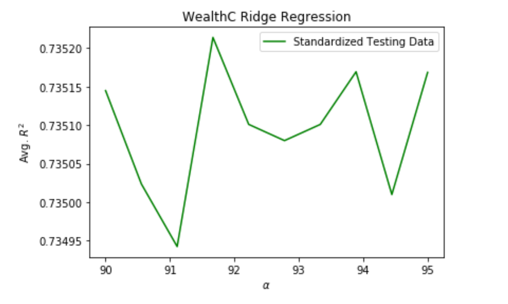
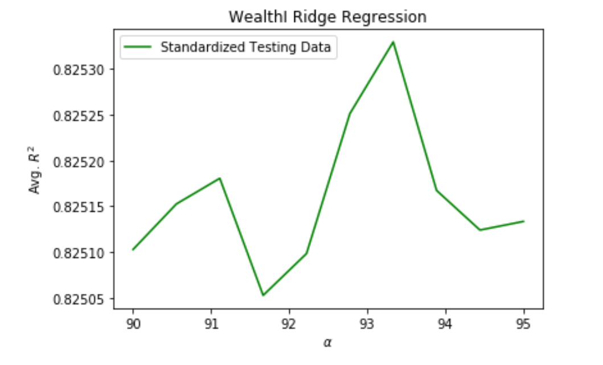
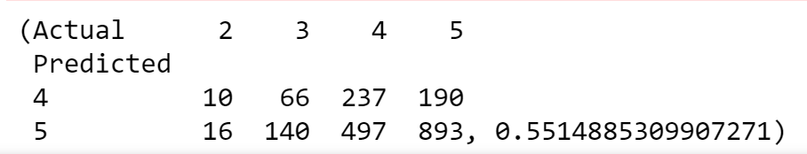
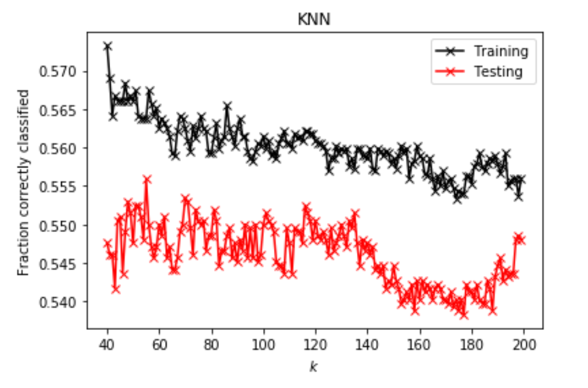
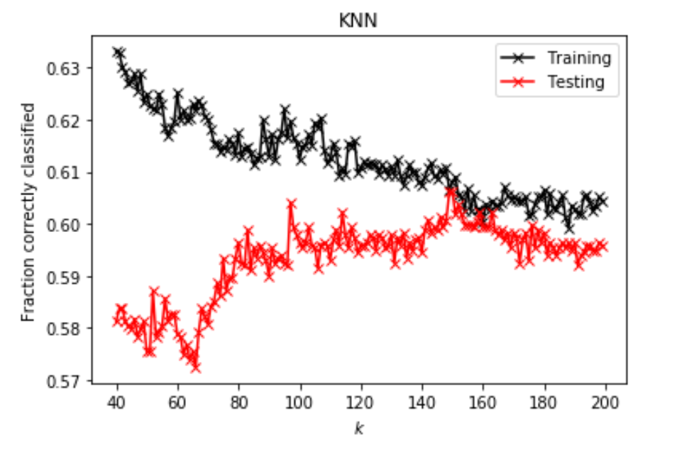

# Project 5, Part I

## Setup 

After downloading and importing the anonymized dataset `persons.csv` and preprocessing the data by converting all values to `int` and filtering out the `NaN` values, I performed three different regressions (linear, Ridge, and Lasso) and computed the Mean Standard Error (MSE) or correlation coefficient (R^2) to compare the performance of each one. 

First, I used the variable `wealthC` as my target, and then I changed it to the variable `wealthI` to determine which is a better indicator of wealth prediction in the unknown West African country. 

For each regression model, I used the raw data and then standardized data to determine correlation between the features (a list of 60 different descriptive factors for people in the country, including potability of the person's water, their age and gender, weather they own a car, the type of electricity and cooking mechanisms present in the home, and more) and the target (either `wealthC` or `wealthI`). 

All of the reported correlation coefficients and MSE are from the testing data, which was used to test the models after "training" to a randomly selected subset of the data, and thus indicate the strength of the model's ability to predict unknown data. 

## Target Variable: `wealthC`

### Linear Regression

First, I performed a Linear Regression using both the raw data and standardized data. Shown below, the MSE and R^2 values indicate a strong correlation between the features and the `wealthC` target. The standardized MSE and R^2 are quite close to the raw data, indicating that standardization does not have a significant effect on the overall measure of correlation. 

|Raw Data MSE|Standardized Data MSE|
|---|---|
|0.44281|0.45205|

|Raw Data R^2|Standardized Data R^2|
|---|---|
|0.73582|0.73031|

The values of R^2 for the two datasets are similar, though not identical, and this is reflected in the correlation coefficients given by the below snippets of code as well. 

The correlation matrices were nearly identical, with small changes a few decimal places down. 

~~~~
tform_df = pd.DataFrame(data=tform_X)
tform_df['wealthC'] = y
tform_df.corr()
~~~~

~~~~
df = pd.DataFrame(data=X)
df['wealthC'] = y
df.corr()
~~~~

`tform_x` and `X` are the standardized and raw feature data, respectively, and `y` represents the target data. 

### Ridge Regression

Similarly to the linear regression model, the Ridge regression performed well with a strong correlation reflected in the R^2 value of around 0.73. The standardized data reflects a very slight improvement on the raw data, and the overall data is comparable to the linear regression model's results. 

|Raw Data R^2|Standardized Data R^2|
|---|---|
|0.73478|0.73505|

### Lasso Regression

The Lasso regression, too, indicates a strong correlation between targets and features, and the correlation is essentially the same as the previous two models. The standardized data shows a slight improvement in correlation. 

|Raw Data R^2|Standardized Data R^2|
|---|---|
|0.73386| 0.73502 |

## Target Variable: `wealthI`

The features clearly correlation with the target variable `wealthC`, with an overall R^2 of around 0.73 across all regression models. 

Next I analyzed the same features with the same regression models with the new target variable of `wealthI`. 

### Linear Regression

The linear regression for this target variable is even more favorable than the previous. The R^2 values, again, are highly comparable and seem to indicate almost no difference between standardized and raw data. 

The correlation matrices are comparable yet again, and the features show a strong ability to predict `wealthI`. 

|Raw Data R^2|Standardized Data R^2|
|---|---|
|0.82383|0.82281|

### Ridge Regression

The Ridge regression for this target is a slight improvement on the linear regression, as shown in the chart below.

|Raw Data R^2|Standardized Data R^2|
|---|---|
|0.82463|0.82520|

### Lasso Regression

Finally, I performed a Lasso regression as in my consideration of `wealthC`, and again found that `wealthI` has a stronger correlation with the features. 

|Raw Data R^2|Standardized Data R^2|
|---|---|
|0.82522|  0.82501 |

## Analysis and Conclusions

Overall, it is clear to see that `wealthI` is a stronger measure of wealth in this anonymous West African country than `wealthC`.

 **Plot 1:**  Plot of *R^2 vs. Alpha value* for Ridge regression. Used standardized dataset of testing data for the `wealthC` target.
 

 **Plot 2:**  Plot of *R^2 vs. Alpha value* for Ridge regression. Used standardized dataset of testing data for the `wealthI` target.
 
The Ridge regression seemed overall best, because although the Lasso R^2 coefficient was slightly higher for the `wealthI` target, it was nearly identical to the Ridge coefficient. For `wealthC`, the Ridge model performed slightly better than the Lasso, and so it seems overall the best indicator of correlation between wealth and our features. Both the Lasso and the Ridge regressions performed better than the linear, though the improvement was so slightly that any of the three can be reliably utilized as a predictor.

# Project 5, Part II

## Setup 
  
In Part II, I analyze a slightly different dataset `city_persons.csv` from a larger city than before, in a West African country. After importing the data, I again preprocessed by excluding null values indicated by `NaN` and changing all of the data to the same data type by converting two of the columns to `int`. 

Whereas last time I considered both  `wealthC` and `wealthI`, this time I only analyze data using `wealthC` as the target. 

This time, my analytical focus will be clustering, to identify into which wealth class persons in the dataset fall, with three different clustering models for comparison.  

## Clustering: K-nearest neighbors

The first clustering method I tried is K-nearest neighbors (KNN), which assings classification to a particular data point according to its "k-nearest" (for some chosen integer k) neighboring points. 

The optimal k-value I found for this data was 95 neighbors, and the testing data correlation coefficient was 0.54417, indicating a moderate correlation.

KNN can be performed using "weights," which can tell KNN which characteristics to consider more than others. In this case, after testing the data without specifying a weight, I told KNN to consider distance between points and weight them using the distance (i.e. closer points would be considered more important than further points in informing a datapoint's classification). 

After adding the distance weight, the optimal k-value turned out to be 128 neighbors, and the correlatin coefficient is slightly lower than before at 0.50756, indicating that the data was slightly more reliably modelled without distance weighting.

## Clustering: Logistic Regression

- Execute a logistic regression method on the data. 
- How did this model fair in terms of accuracy compared to K-nearest neighbors?

Next, I performed a logistic regression on the dataset, after scaling the data using `StandardScaler`. 

|  Training R^2  |  Testing R^2  |
|----|----|
| 0.54979 | 0.54677 |

The logistic regression performed better than the weighted KNN model, and slightly better (though similarly) to the unweighted KNN model. 

Since the training better has a slightly higher correlation than the testing, we can see that the data is slightly overfit, but overall the values are quite close and comparable.

Logistic regression results from `CompareClasses()`:

 **Figure 1:**  Screenshot of comparison matrix output from `CompareClasses()`, with accuracy 0.55, sorting the data into classes and indicating accuracy of said sorting.

## Clustering: Random Forest Model

- Also test the minimum number of samples required to split an internal node with
  a range of values. 
- Also produce results for your four different estimator values by both comparing
  both standardized and non-standardized (raw) results.

Next, I executed a random forest model and ran it four times, with 100, 500, 1000, and 5000 trees. In all of these trials, I found my data was quite underfit, as the average training score was over 0.7 for each trial. 

| Trees | Testing R^2 |
| --- | ---|
| 100 | 0.50464 |
| 500 | 0.49487 |
| 1000| 0.49780 |
| 5000| 0.50512 |

The Each of these performed worse than the KNN and logistic models, so I tried standardizing the data. 

After standardization, the new chart (below) depicts data that is slightly more correlated than before, though overall very similar. 

The most accurate of all of these trials is the 5000-tree forest of unscaled data.

| Trees | Testing R^2 | Scaled Testing R^2 |
| --- | ---| ----| 
| 100 | 0.48804 | 0.49195 |
| 500 | 0.49244 | 0.49927 |
| 1000| 0.49732 | 0.50122 |
| 5000| 0.48902 | 0.50220 |

## Merging clusters 2, 3

Since the predictive power of these models is weak, I combined classes 2 and 3 into a single outcome. The new correlation coefficients improved, indicating that the initial classes didn't fit the data very well. Which the new classifications, we see much stronger predictive power in our models.

| | KNN | Logistic Regression | Random Forest |
| --|---|---|---|
| R^2 | 0.60615 | 0.59688 | 0.60827 |

## Conclusions and Analysis

Overall, the model performed best when considering classes 2 and 3 as a single classification. Under these conditions, the models that performed best were KNN and Random Forest. Their correlation coefficients were very close, but overall the Random Forest model performed slightly better because, while both models were underfit (indicating a low predictive power when the model is confronted with new information), its discrepancy between training and testing coefficients was smaller. 

| | Training | Testing |
|--|--|--|
| KNN | 0.79631 | 0.60615 |
| Random Forest | 0.696235 | 0.60827 |

From the plots below, we can see visual confirmation that the class conbination improved out model, as the training and testing scores were much closer together. 

 **Plot 1:**  Plot of *R^2 vs. K-value* for K-nearest neighbors model.
 
 

 **Plot 2:**  Plot of *R^2 vs. K-value* for K-nearest neighbors model using the merged class for classes 2, 3.

