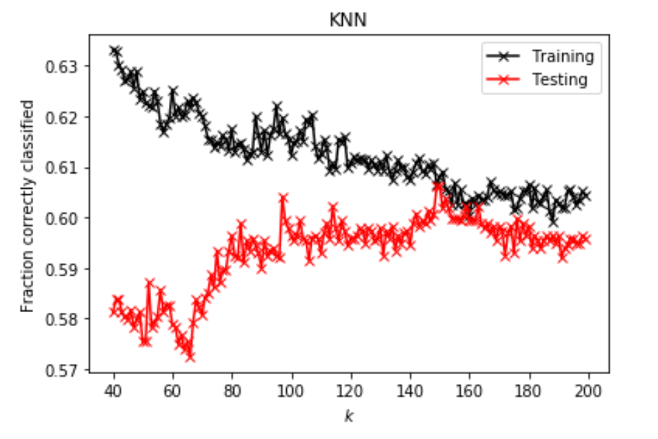

# Project 5, Part II

## Setup 
  
In Part II, I analyze a slightly different dataset `city_persons.csv` from a larger city than before, in a West African country. After importing the data, I again preprocessed by excluding null values indicated by `NaN` and changing all of the data to the same data type by converting two of the columns to `int`. 

Whereas last time I considered both  `wealthC` and `wealthI`, this time I only analyze data using `wealthC` as the target. 

This time, my analytical focus will be clustering, to identify into which wealth class persons in the dataset fall, with three different clustering models for comparison.  

## Clustering: K-nearest neighbors

The first clustering method I tried is K-nearest neighbors (KNN), which assings classification to a particular data point according to its "k-nearest" (for some chosen integer k) neighboring points. 

The optimal k-value I found for this data was 95 neighbors, and the testing data correlation coefficient was 0.54417, indicating a moderate correlation.

KNN can be performed using "weights," which can tell KNN which characteristics to consider more than others. In this case, after testing the data without specifying a weight, I told KNN to consider distance between points and weight them using the distance (i.e. closer points would be considered more important than further points in informing a datapoint's classification). 

After adding the distance weight, the optimal k-value turned out to be 128 neighbors, and the correlatin coefficient is slightly lower than before at 0.50756, indicating that the data was slightly more reliably modelled without distance weighting.

## Clustering: Logistic Regression

- Execute a logistic regression method on the data. 
- How did this model fair in terms of accuracy compared to K-nearest neighbors?

Next, I performed a logistic regression on the dataset, after scaling the data using `StandardScaler`. 

|  Training R^2  |  Testing R^2  |
|----|----|
| 0.54979 | 0.54677 |

The logistic regression performed better than the weighted KNN model, and slightly better (though similarly) to the unweighted KNN model. 

Since the training better has a slightly higher correlation than the testing, we can see that the data is slightly overfit, but overall the values are quite close and comparable.

Logistic regression results from `CompareClasses()`:

 **Figure 1:**  Screenshot of comparison matrix output from `CompareClasses()`, with accuracy 0.55, sorting the data into classes and indicating accuracy of said sorting.

## Clustering: Random Forest Model

- Also test the minimum number of samples required to split an internal node with
  a range of values. 
- Also produce results for your four different estimator values by both comparing
  both standardized and non-standardized (raw) results.

Next, I executed a random forest model and ran it four times, with 100, 500, 1000, and 5000 trees. In all of these trials, I found my data was quite underfit, as the average training score was over 0.7 for each trial. 

| Trees | Testing R^2 |
| --- | ---|
| 100 | 0.50464 |
| 500 | 0.49487 |
| 1000| 0.49780 |
| 5000| 0.50512 |

The Each of these performed worse than the KNN and logistic models, so I tried standardizing the data. 

After standardization, the new chart (below) depicts data that is slightly more correlated than before, though overall very similar. 

The most accurate of all of these trials is the 5000-tree forest of unscaled data.

| Trees | Testing R^2 | Scaled Testing R^2 |
| --- | ---| ----| 
| 100 | 0.48804 | 0.49195 |
| 500 | 0.49244 | 0.49927 |
| 1000| 0.49732 | 0.50122 |
| 5000| 0.48902 | 0.50220 |

## Merging clusters 2, 3

Since the predictive power of these models is weak, I combined classes 2 and 3 into a single outcome. The new correlation coefficients improved, indicating that the initial classes didn't fit the data very well. Which the new classifications, we see much stronger predictive power in our models.

| | KNN | Logistic Regression | Random Forest |
| --|---|---|---|
| R^2 | 0.60615 | 0.59688 | 0.60827 |

## Conclusions and Analysis

Overall, the model performed best when considering classes 2 and 3 as a single classification. Under these conditions, the models that performed best were KNN and Random Forest. Their correlation coefficients were very close, but overall the Random Forest model performed slightly better because, while both models were underfit (indicating a low predictive power when the model is confronted with new information), its discrepancy between training and testing coefficients was smaller. 

| | Training | Testing |
|--|--|--|
| KNN | 0.79631 | 0.60615 |
| Random Forest | 0.696235 | 0.60827 |

From the plots below, we can see visual confirmation that the class conbination improved out model, as the training and testing scores were much closer together. 

 **Plot 1:**  Plot of *R^2 vs. K-value* for K-nearest neighbors model.
 
 

 **Plot 2:**  Plot of *R^2 vs. K-value* for K-nearest neighbors model using the merged class for classes 2, 3.

